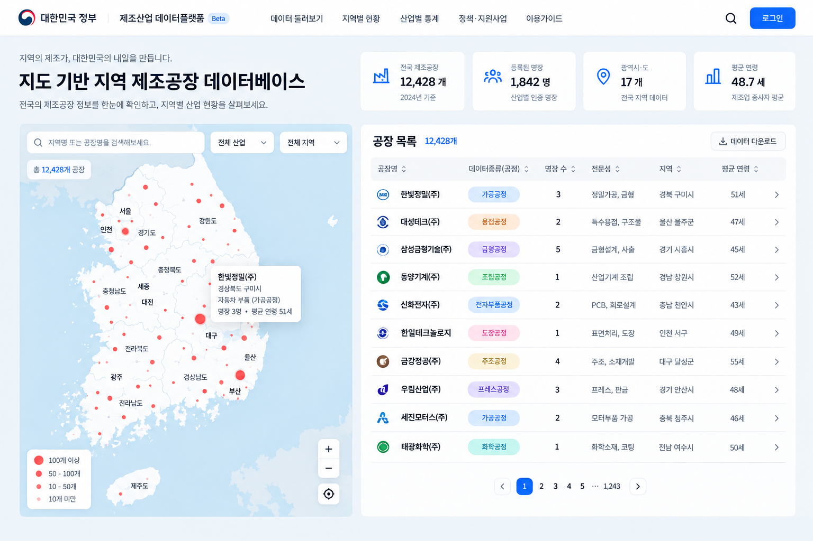

# 로보후드(RoboHood) — AI for Good 해커톤 기획안

> 지역 청년이 산업현장의 Physical AI 데이터를 수집하고, 적합한 AI 모델과 로봇을 현장에 배포·운영하여 다시 데이터를 축적하는 지역 Physical AI 전환 플랫폼

- 작성일: 2026-09-17
- 상태: 팀 논의를 위한 통합 기획 초안
- 주의: 이 문서는 현재까지 확인한 행사 정보와 팀 아이디어를 구분하여 정리한 초안입니다. 프로토타입 구현, KAMP API 연동, 공장 협력, 성능 및 고용 효과는 아직 검증된 사실이 아닙니다.

## 1. 관련 링크

- 행사 안내: <https://luma.com/sfdsjsxi>
- 팀 배정 시트: <https://docs.google.com/spreadsheets/d/1ecLzgoYdHuH76vKPhOAq8OXDws_VC0nkrkbukybozAQ/edit?gid=0#gid=0>
- 3분 발표 슬라이드 템플릿: <https://docs.google.com/presentation/d/1eIskfWL6Dyagc8Zs1nfvhZu_7rtnvcC2xxpXmu_0vcg/edit?slide=id.p1#slide=id.p1>
- 참가자 가이드: <https://ai-impact-guide.vercel.app>
- KAMP: <https://www.kamp-ai.kr/>
- KAMP 제조데이터 라이브러리: <https://mdata.kamp-ai.kr/>

## 2. 행사 요구사항과 심사 기준

### 제출 미션

1. 사회문제 정의
2. 동작하는 프로토타입
3. 정책·공공지원 제안 1장

### 심사 기준: 4항목 × 5점 = 20점

| 항목 | 심사 질문 | 우리 기획의 대응 |
|---|---|---|
| 문제 정의 | 누구의 어떤 문제인지 구체적인가 | 서울의 도시제조 소공인과 지역 청년으로 대상을 좁힌다. |
| 작동성 | 핵심 기능이 실제로 동작하는가 | 실제 센서 입력이 모델 판단과 물리 장치 상태 변화로 이어지는 한 흐름을 구현한다. |
| 정책 연결 | 서울시·교육청이 무엇을 해야 하는지 분명한가 | 서울시는 실증현장과 일자리를 만들고, 교육청은 직업계고 중심의 기초 인력을 양성한다. |
| 실현 가능성 | 내일부터 현장에 적용할 수 있는가 | 전체 플랫폼이 아닌 1개 작업·1개 장치·1개 현장의 소규모 실증안을 제시한다. |

대중 투표와 전문가 심사가 함께 반영되므로, 3분 안에 `문제 → 실제 작동 → 청년 일자리 → 정책`이 한 번에 이해되어야 한다.

## 3. 현재 문제 정의

### 3.1 제조 소공인의 문제

- Physical AI를 도입하고 싶어도 어떤 데이터를 수집해야 하는지 알기 어렵다.
- 센서, 카메라, 로봇을 설치하고 운영할 전문인력을 별도로 고용하기 어렵다.
- 데이터가 있어도 적합한 모델과 로봇 하드웨어를 선택하고 현장에 적용하기 어렵다.
- 서로 다른 공급기업의 데이터 형식, 모델 및 장비 호환성을 비교하기 어렵다.
- 도입 이후에도 캘리브레이션, 오류 대응, 재학습용 데이터 수집이 지속적으로 필요하다.

### 3.2 청년의 문제

- AI와 데이터 기술을 학습해도 실제 산업현장에서 경험을 쌓을 진입형 일자리가 부족하다.
- 단기 데이터 라벨링이나 배달형 긱 노동은 전문 경력으로 이어지기 어렵다.
- 수도권의 일반적인 IT 직무와 지역 제조업 현장 사이를 연결하는 직무·교육 체계가 부족하다.

### 3.3 핵심 가설

> 현장 데이터 수집부터 모델 적용, 로봇 배포, 지속 운영까지 하나의 업무 흐름으로 연결하면 제조 소공인의 Physical AI 도입장벽을 낮추고, 청년에게 단계적으로 성장할 수 있는 현장 기술 일자리를 만들 수 있다.

이 가설은 해커톤 프로토타입과 향후 현장 인터뷰를 통해 검증해야 한다.

## 4. 통합 플랫폼 비전

홍주영 팀장이 제안한 앞단의 `산업현장 데이터 수집`과 김건동이 제안한 후단의 `모델·하드웨어 선택 및 현장 배포`를 하나의 폐쇄형 순환으로 연결한다.

```text
산업현장 문제 등록
        ↓
청년 오퍼레이터의 현장 데이터 수집
        ↓
데이터 검수·라벨링·권리 관리
        ↓
RFM 또는 작업별 AI 모델 선택·적용
        ↓
현장에 적합한 로봇 하드웨어 매칭
        ↓
청년 오퍼레이터의 설치·배포·운영
        ↓
실패·운영 데이터 재수집
        └──────── 모델 개선으로 순환
```

여기서 RFM은 `Robot Foundation Model(로봇 파운데이션 모델)`을 뜻한다. 발표에서는 일반적인 고객분석 용어의 RFM과 혼동되지 않도록 처음 등장할 때 풀어 쓴다.

## 5. 플랫폼 구성

| 모듈 | 핵심 기능 | 프로토타입 범위 |
|---|---|---|
| 현장 수요 등록 | 공정, 작업, 공간, 데이터 종류, 보안조건 등록 | 가상 제조 소공인 1곳의 검사·분류 과제 등록 |
| 오퍼레이터 매칭 | 위치, 기술, 장비, 안전교육 기준으로 청년 배정 | 지도에서 인근 오퍼레이터 1명 배정 |
| Field DataOps | 센서·영상·행동 데이터 수집, 체크리스트, 라벨링 | 소형 센서 또는 카메라 데이터 실제 수집 |
| 데이터 거버넌스 | 동의, 영업기밀, 보관기간, 접근권한, 품질기록 | 데이터 카드와 수집 이력 표시 |
| ModelOps | 모델 탐색, 적용 조건, 평가 결과, 버전 관리 | 사전학습 모델 또는 경량 모델 1개 적용 |
| Robot Match | 작업·공간·예산·인터페이스 기준 장비 추천 | 소형 장치 1종과 가상 후보 2종 비교 |
| DeployOps | 설치, 캘리브레이션, 맵핑, API 연결 | 모델 판단에 따라 LED·모터·소형 장치 작동 |
| FleetOps | 장비 상태, 장애, 성능, 재수집 요청 관리 | 상태·오류·작업 결과 대시보드 |

## 6. KAMP와의 관계

### KAMP가 이미 제공하는 영역

- 제조 AI 데이터셋과 제조데이터 라이브러리
- 제조 AI 분석도구와 체험환경
- 제조 AI 적용 사례와 교육 콘텐츠
- 제조데이터 표준화 자료
- 제조 AI 솔루션 공급기업 Pool

### 로보후드가 보완하려는 영역

- 공장이 요구하는 데이터 수집 프로젝트 정의
- 지역·기술·안전교육 기반 현장 오퍼레이터 배정
- 센서 설치와 텔레오퍼레이션 등 현장 실행
- 데이터 품질과 권리 기록
- 모델·로봇 하드웨어의 현장 적합성 확인
- 설치, 배포, 관제, 유지보수
- 운영 실패 데이터를 다시 수집하는 폐쇄형 순환

따라서 로보후드는 `또 다른 제조데이터 거래 플랫폼`이 아니라 **KAMP의 데이터·분석 생태계와 산업현장의 마지막 1마일을 연결하는 실행 레이어**로 포지셔닝한다.

### 표현상 주의

- 실제 API와 이용 조건을 확인하기 전에는 `KAMP와 연동했다`고 말하지 않는다.
- 프로토타입에서는 `KAMP 연계 구상`, `KAMP 호환 데이터 패키지`, `KAMP 생태계를 활용하는 구조`라고 표현한다.
- KAMP 데이터가 곧바로 RFM 학습에 적합하다고 단정하지 않는다. 공정 센서 데이터와 로봇 행동 데이터는 목적과 구조가 다를 수 있다.

## 7. 청년 Physical AI 오퍼레이터 직무

단순 수집 긱 노동이 아니라 교육과 경험을 통해 발전하는 경력경로로 설계한다.

```text
현장 데이터 수집 오퍼레이터
→ 데이터 품질·라벨링 관리자
→ 모델·로봇 배포 오퍼레이터
→ 로봇 관제·유지보수 담당자
→ Physical AI 현장 컨설턴트 또는 로컬 에이전시 창업
```

### 업무 예시

- 공장 방문 전 안전·보안 조건 확인
- 센서·카메라 설치와 수집 상태 점검
- 로봇 텔레오퍼레이션과 행동 시연 데이터 생성
- 현장 변수를 기록하고 데이터 품질 검수
- 모델·하드웨어 호환성 확인
- 로봇 설치, 캘리브레이션, 동선 맵핑
- 장애 대응과 재학습 데이터 수집

### 일자리 품질 원칙

- 건당 수집 수수료만 지급하는 단기 긱 노동에 머물지 않는다.
- 안전교육, 기술등급, 멘토링, 경력증명 체계를 포함한다.
- 데이터 수집자와 촬영 대상자의 동의·거부권을 보장한다.
- 현장 위험도와 숙련도에 따라 업무 배정과 보상을 차등화한다.
- 장기적으로 유지보수 계약과 지역 에이전시 창업으로 연결한다.

## 8. 서울시·서울시교육청 정책 제안

### 서울시

- 서울 소재 도시제조 소공인 중 Physical AI 실증현장 모집
- 센서·로봇 설치와 현장 데이터 수집 바우처 제공
- 실증용 공동 장비와 안전한 테스트베드 구축
- 청년 오퍼레이터의 유급 실증 일자리 지원
- 제조사 간 데이터·API·유지보수 기준 마련
- 데이터 권리, 영업기밀, 작업자 개인정보 표준계약 지원
- 실증 종료 후 제조기업 취업 또는 로컬 에이전시 창업 연계

### 서울시교육청

- 직업계고 학생을 위한 센서·데이터·로봇 운영 기초교육
- 산업안전과 데이터 윤리를 포함한 실습과정 운영
- 교내 모의 제조환경에서의 데이터 수집·배포 실습
- 졸업예정자 대상 현장실습 및 지역기업 취업 연계

### 역할 구분 한 문장

> 서울시는 실증현장과 유급 일자리를 만들고, 서울시교육청은 안전하게 현장에 진입할 기초인력을 양성한다.

미성년 학생을 실제 산업현장에 투입할 경우 산업안전과 현장실습 관련 요건을 먼저 검토해야 한다. 해커톤 발표에서는 `교육 후 즉시 위험 현장 투입`으로 오해되지 않도록 교내 모의실습과 졸업예정자 연계를 구분한다.

## 9. 해커톤 MVP

### 목표

> 하나의 현장 과제가 실제 데이터 수집에서 물리 장치 동작과 운영 데이터 재수집까지 끝까지 이어지는 것을 보여준다.

### 권장 데모 시나리오

1. 가상의 서울 도시제조 소공인이 검사·분류 작업을 등록한다.
2. 지도에서 가까운 청년 오퍼레이터가 작업을 수락한다.
3. 카메라 또는 센서로 실제 데이터를 수집한다.
4. 데이터 품질과 수집 이력을 화면에 표시한다.
5. 사전학습 모델 또는 경량 모델이 정상·이상, 작업 상태 등을 판별한다.
6. 결과에 따라 LED·모터·서보 또는 소형 이동장치가 실제로 반응한다.
7. 배포 상태와 오류를 관제 화면에서 확인한다.
8. 실패 사례를 재수집 목록에 추가해 폐쇄형 순환을 완성한다.

### 현실적인 구현 원칙

- 해커톤에서 RFM을 처음부터 학습하지 않는다.
- `데이터베이스를 만들었다`보다 `하나의 실제 데이터가 끝까지 흘렀다`를 우선한다.
- 공장 전체 자동화가 아니라 소형 제조공정 모형 하나를 다룬다.
- 하드웨어가 없다면 디지털 트윈을 사용할 수 있지만 실제 물리 장치가 아님을 명확히 밝힌다.
- 지도·오퍼레이터 매칭은 핵심 차별점이 아니라 전체 흐름을 연결하는 보조 기능으로 취급한다.

### 하드웨어가 없을 때의 최소 대안

- 스마트폰 카메라 또는 마이크로 데이터 수집
- 브라우저 또는 로컬 모델로 상태 판별
- 마이크로컨트롤러가 없으면 장치 API 시뮬레이터로 명령 전달
- 화면의 디지털 트윈 상태 변화와 관제 이벤트를 실제 코드로 구현

이 경우 발표에서 `산업현장에 배포 완료`라고 표현하지 않고 `배포 흐름을 기능적으로 검증한 프로토타입`이라고 말한다.

## 10. 대안 기획: 소상공인 매장 Physical AI 전환 플랫폼

기존 1번과 4번을 합친 대안이다.

> 매장에 적합한 로봇·POS·센서를 추천하고, 청년 오퍼레이터가 설치·연동·유지보수하며 고령 소상공인은 음성으로 장비를 제어하는 서비스

### 핵심 흐름

```text
매장 정보 입력
→ 제조사 중립 장비 추천·호환성 비교
→ 지역 청년 오퍼레이터 배정
→ 설치·연동·사용교육
→ 음성으로 POS·로봇·센서 제어
→ 통합 관제와 장애 대응
```

### 벤치마크와 차별화

- 스마트상점 기술보급사업: 장비·소프트웨어 도입과 비용 지원
- KT 사장이지: KT 로봇·기가아이즈·하이오더·AI전화의 통합 관리
- 제안 차별점: 제조사 중립 호환성 진단, 지역 청년 오퍼레이터, 고령 소상공인 음성 제어

### 장점과 한계

- 장점: 대중이 이해하기 쉽고, 작은 장치로 시연하기 쉬우며, 서울시 소상공인 정책과 직접 연결된다.
- 한계: 기존 스마트상점·KT 서비스와 유사해 보일 수 있으며, 제품 비교 화면에 치우치면 Physical AI의 작동성이 약해진다.

## 11. 두 기획 비교

| 비교 항목 | 매장 Physical AI 통합안 | 데이터→로봇 배포 통합안 |
|---|---|---|
| 주요 대상 | 음식점·카페 등 소상공인 | 서울의 도시제조 소공인 |
| 핵심 문제 | 장비 선택·연동·관리 어려움 | 현장 데이터와 배포 전문인력 부족 |
| 핵심 흐름 | 매장 진단→장비 추천→음성 제어→관제 | 수집→모델→하드웨어→배포→재수집 |
| 청년 직무 | 매장 자동화 설치·운영자 | 데이터 수집에서 로봇 배포까지 성장하는 오퍼레이터 |
| 벤치마크 | 스마트상점, KT 사장이지 | KAMP, 스마트공장 생태계 |
| 대중 이해도 | 높음 | 기술 설명이 더 필요함 |
| 기술적 독창성 | 보통 | 높음 |
| 프로토타입 난이도 | 상대적으로 낮음 | 상대적으로 높음 |
| 주요 위험 | 기존 서비스와 유사 | 범위 과대, 공장·데이터·하드웨어 부재 |
| 팀 아이디어 통합성 | 김건동의 배포 구상 중심 | 홍주영의 수집안과 김건동의 배포안을 직접 통합 |

### 예상 배점

아래 점수는 구현 전 기획 기준 예상치이며, 실제 심사점수가 아니다.

| 심사 항목 | 매장 Physical AI 통합안 | 데이터→로봇 배포 통합안 |
|---|---:|---:|
| 문제 정의 | 4.5/5 | 4.5/5 |
| 작동성 | 4.0/5 | 3.5/5 |
| 정책 연결 | 4.5/5 | 4.0/5 |
| 실현 가능성 | 4.0/5 | 3.5/5 |
| **예상 총점** | **17.0/20** | **15.5/20** |

데이터→로봇 배포 통합안이 실제 센서 입력부터 장치 작동까지 완성되면 작동성은 4.5점 수준을 기대할 수 있고 총점도 16.5~17점까지 올라갈 수 있다.

## 12. 현재 권고안과 결정 게이트

### 권고안

팀장과 팀원의 아이디어를 함께 살리고 기술적으로 차별화하기 위해 **데이터→로봇 배포 통합안**을 1순위로 검토한다.

단, 아래 조건을 만족하지 못하면 매장 Physical AI 통합안으로 범위를 줄이는 것이 안전하다.

### 결정 게이트

| 확인 사항 | 통과 기준 | 미통과 시 |
|---|---|---|
| 실제 데이터 입력 | 센서·카메라·마이크 중 하나를 실시간 또는 재현 가능하게 입력 | 매장 음성 제어 데모로 전환 검토 |
| 물리 장치 | LED·모터·서보·소형 로봇 중 하나를 코드로 제어 | 디지털 트윈으로 축소하고 한계를 명시 |
| 모델 | 실제 입력을 판별하는 모델 또는 규칙 엔진이 동작 | RFM 주장을 줄이고 상태 판별로 범위 축소 |
| 서울 현장 서사 | 도시제조 소공인 1개 유형과 작업 1개를 선정 | 일반 제조업 국가전략 서사를 축소 |
| 정책 역할 | 서울시와 교육청 역할을 각각 한 문장으로 설명 | 정책 슬라이드를 다시 작성 |
| 3분 시연 | 60~90초 안에 전체 흐름 재현 | 화면과 기능 수를 줄임 |

## 13. 3분·10장 발표 구성안

1. **제목:** 데이터에서 로봇 배포까지, 로보후드
2. **현장 문제:** 데이터도, 배포인력도 없는 도시제조 소공인
3. **청년 문제:** AI를 배워도 현장 경력으로 연결되지 않는 청년
4. **해결 구조:** 수집→모델→하드웨어→배포→재수집 순환
5. **사용자 여정:** 공장 과제 등록과 오퍼레이터 배정
6. **동작 시연:** 실제 데이터 입력→판단→장치 반응
7. **플랫폼:** Field DataOps·ModelOps·DeployOps·FleetOps
8. **일자리:** 수집자에서 배포·관제 전문가로 성장하는 경로
9. **정책:** 서울시 실증·고용 + 교육청 기초인력 양성
10. **마무리:** 한국의 제조현장을 청년의 Physical AI 경력과 연결

3분 발표에서는 슬라이드의 텍스트를 읽지 말고, 6번 시연을 중심으로 앞뒤의 문제와 정책을 연결한다.

## 14. 팀 내 제안 역할 분담

아래는 합의된 배정이 아니라 논의를 위한 제안이다.

| 영역 | 제안 담당 | 주요 산출물 |
|---|---|---|
| 현장 데이터 수집 문제·사용자 흐름 | 홍주영 | 수집 작업 정의, 공장 측 사용자 여정, 데이터 품질·안전 체크리스트 |
| 모델·하드웨어 선택과 배포 흐름 | 김건동 | 배포 아키텍처, 장치 연동, 관제 화면, 청년 오퍼레이터 경력경로 |
| 정책과 발표 | 공동 | 서울시·교육청 역할, 3분 발표, 데모 리허설 |
| UI·프로토타입 | 결정 필요 | 수요 등록, 매칭, 수집, 배포, 관제의 최소 화면 |
| 하드웨어·센서 | 결정 필요 | 보유 장비 목록과 실제 제어 가능 여부 확인 |

## 15. 즉시 결정해야 할 사항

- [ ] 최종 주제를 데이터→로봇 배포 통합안으로 확정할지
- [ ] 첫 대상 업종과 제조 작업을 무엇으로 정할지
- [ ] 사용할 수 있는 실제 센서·모터·로봇이 있는지
- [ ] 모델이 판단할 한 가지 상태를 무엇으로 정할지
- [ ] KAMP는 데이터 출처, 표준 참고, 또는 미래 연계 중 어디까지 사용할지
- [ ] 청년의 시작 직무와 성장 직무를 어떻게 표현할지
- [ ] 서울시와 교육청에 각각 요구할 정책 한 가지를 무엇으로 정할지
- [ ] 개인정보·영업기밀·작업자 동의를 데모에서 어떻게 표시할지
- [ ] 3분 발표 중 라이브 시연에 사용할 시간을 몇 초로 정할지
- [ ] 프로젝트 이름 `로보후드`를 유지할지

## 16. 검증해야 할 핵심 가정

| 가정 | 검증 방법 |
|---|---|
| 제조 소공인이 데이터 수집 인력을 필요로 한다 | 도시제조 소공인 또는 지원기관 인터뷰 |
| 청년이 안전교육 후 현장 수집·배포 업무를 수행할 수 있다 | 직무분석, 현장 책임자·교육기관 인터뷰 |
| 수집 데이터가 실제 모델 개선에 사용될 수 있다 | 작업별 데이터 명세와 모델 입력 요구사항 비교 |
| KAMP와 연계 가능한 데이터 형식을 만들 수 있다 | KAMP 이용가이드·데이터 규격·API 조건 확인 |
| 로봇과 모델의 호환성을 플랫폼에서 비교할 수 있다 | 제조사 API, 프로토콜, 엣지 요구사항 조사 |
| 지자체 지원 이후 지속 가능한 수익이 발생한다 | 유지보수 계약, 구독료, 배포 수수료 가설 검증 |

## 17. 위험과 대응

| 위험 | 대응 |
|---|---|
| 범위가 너무 넓어 작동 기능이 없음 | 제조 작업 하나와 장치 하나만 구현 |
| KAMP를 복제하는 아이디어로 보임 | 현장 수집·배포·운영이라는 실행 레이어 강조 |
| 청년 일자리가 저임금 긱 노동으로 보임 | 교육·기술등급·유지보수 경력경로 제시 |
| 공장 영상·행동 데이터가 영업기밀이나 개인정보를 침해 | 최소수집, 비식별화, 권한·보관기간·동의 표시 |
| 공장 출입과 장비 설치가 내일부터 불가능 | 해커톤에서는 모의 공정으로 기능 검증, 현장 적용은 단계화 |
| RFM이라는 표현이 과도함 | 실제 구현이 경량 모델이면 그 사실을 정확히 설명 |
| 지도 화면이 멋진 이미지에 그침 | 지도보다 실제 데이터 흐름과 물리 장치 반응을 우선 |

## 18. 참고 이미지

초기 아이디어에서 생성한 제조공장 지도·데이터베이스 콘셉트 이미지이다. 표시된 공장 수, 명장 수, 연령, 기업명 등은 검증된 통계가 아니라 시각적 예시이므로 발표의 사실 근거로 사용하지 않는다.


